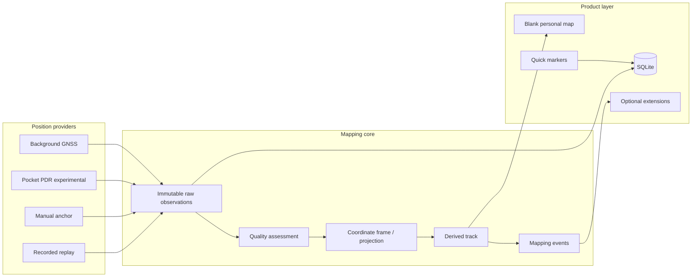

# Architecture

## 方針

位置推定、地図の真実、表示、ゲーム体験を分離する。最も不確実な屋内PDRが失敗しても、プロダクト全体を書き直さない構造にする。



## Canonical data

### Raw observations

端末から得たサンプルをそのまま保持する。

- timestamp
- source: gnss / pdr / manual / simulation
- coordinate: geographic / local
- accuracy and confidence
- heading, speed, altitude when available
- acceptance and rejection reason are derived metadata

異常値を削除しない。フィルタ規則を改善した時に再処理できるようにする。

### Derived personal map

- local 2D track
- track segments and gaps
- bounds and distance
- markers
- optional explored corridor / topology

派生地図はraw observationsから再構築できる。

## Coordinate frames

マップ表示は常にローカルメートル座標へ正規化する。

- GNSS探索: 最初の受理済み座標を原点に投影
- GPSなし探索: 開始地点を `(0, 0)` とする
- 将来のhybrid: 明示的なanchor transformでフレームを接続

これにより、既存地図や緯度経度がなくても同じレンダラーを使用できる。

## PositionProvider port

端末APIは次の責務だけを持つ。

```ts
interface TrackingProvider {
  id: string;
  coordinateKind: "geographic" | "local";
  start(mode: "background" | "foreground"): Promise<void>;
  stop(): Promise<void>;
  status(): Promise<TrackingRuntimeStatus>;
}
```

providerは地図を描かない。位置サンプルを記録するだけにする。

## Background task and persistence

バックグラウンドタスクはReact UI状態に依存しない。

```text
OS location callback
  → active exploration idをSQLiteから取得
  → raw sampleを追加
  → UI復帰時に全サンプルをmapping-coreへreplay
  → derived trackを描画
```

クラッシュやプロセス再生成に強くし、UIとバックグラウンド処理の二重状態を避ける。

## Extension boundary

ゲームやテーマは `MappingExtension` として扱う。

```ts
interface MappingExtension {
  id: string;
  onEvent(event: MappingEvent, map: Readonly<MapSnapshot>): DerivedOverlay[];
}
```

禁止事項:

- raw samplesを変更する
- accepted / rejected判定をゲーム都合で変える
- コアの探索地図を実績状態に依存させる
- ゲーム拡張が存在しないと記録できない設計

## Privacy and data ownership

MVPはlocal-firstとし、アカウントやクラウドを要求しない。位置履歴は高感度データなので、同期を追加する場合は暗号化、明示的な送信、削除、エクスポートを先に設計する。
