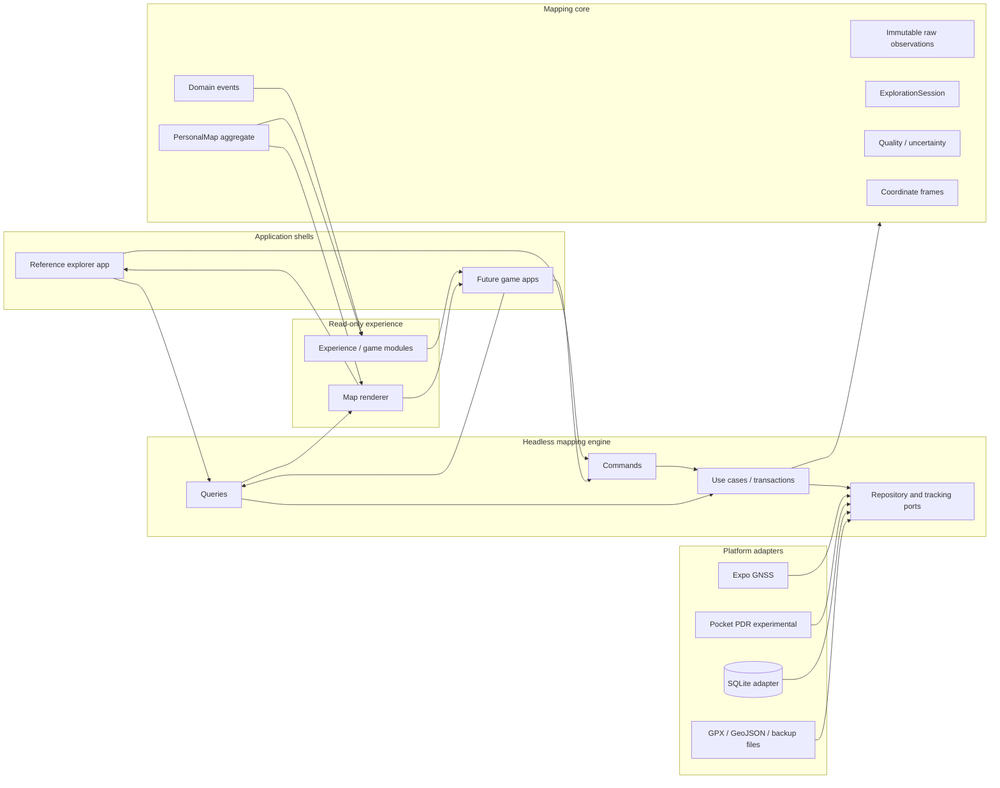

# Architecture

## 方針

位置推定、地図の真実、application transaction、保存、表示、ゲーム体験を分離する。最も不確実な屋内PDRが失敗した場合や、将来ゲームアプリを増やした場合でも、PersonalMapの正本とraw evidenceを作り直さない構造にする。

機能配置の詳細な判断基準は [`FEATURE_PLACEMENT.md`](FEATURE_PLACEMENT.md)、恒久判断は [ADR 0006](adr/0006-headless-mapping-engine-and-experience-boundary.md)、[ADR 0007](adr/0007-control-canonical-map-write-authority.md)、[ADR 0012](adr/0012-preserve-exact-raw-observation-payload-and-order.md) を参照する。

## Layer model



## Dependency direction

```text
apps ───────────────▶ mapping-engine ─────────▶ mapping-core
  │                         ▲
  │                         │ implements ports
  ├──▶ renderer         platform adapters
  │
  └──▶ experience-sdk / game modules
```

- `mapping-core` は外側のpackageへ依存しない。
- `mapping-engine` はrendererやgameへ依存しない。
- rendererとexperienceはread-only snapshotを扱う。
- future `apps/game-*` はcore mutationを直接importしない。
- platform adapterは観測・保存を担当し、map truthや報酬を決めない。

## Package responsibilities

### `packages/mapping-core`

純粋TypeScriptのdomain kernel。

- raw observations
- accepted / rejectedと理由
- ExplorationSession
- PersonalMap aggregate
- coordinate framesと明示anchor
- segment、gap、marker、uncertainty
- replay可能なderived map
- MappingEvent

禁止する依存:

- React / React Native / Expo
- SQLite / filesystem / network
- permission / notification
- renderer
- experience、game state、実績、クエスト

### `packages/mapping-engine`

explorer appとgame appが呼ぶheadless application facade。canonicalな個人地図への明示的な書き込み境界とする。

```ts
interface MappingEngine {
  createPersonalMap(command: CreatePersonalMapCommand): Promise<{ personalMapId: string }>;
  startExploration(command: StartExplorationCommand): Promise<{ explorationId: string }>;
  ingestPositionSamples(command: IngestPositionSamplesCommand): Promise<IngestPositionSamplesResult>;
  addMarker(command: AddMarkerCommand): Promise<void>;
  endExploration(command: EndExplorationCommand): Promise<{ map: PersonalMapSnapshot }>;
  getPersonalMap(query: GetPersonalMapQuery): Promise<PersonalMapSnapshot | null>;
  listPersonalMaps(): Promise<readonly PersonalMapListItem[]>;
  subscribe(listener: MappingEngineListener): () => void;
}
```

engineはmutableなExplorationSessionやcore mutation関数をappへ渡さない。commandごとにinvariant、persistence、tracking、event publicationを一貫させる。

実装上の規則:

- canonical repository transactionが完了してからMappingEventを公開する
- UI / game listenerの失敗でcommit済みwriteを巻き戻さない
- duplicate platform callbackはrepositoryでidempotentにする
- tracking provider開始失敗時は作成途中のsession recordを補償削除する
- 終了後に遅延到着したcallbackはrawに保持してもderived trackへ戻さない
- lossless bundleの内容、hash、validation、staging、collision policyはplatform runtimeから独立させる

### `packages/sqlite-adapter`

`mapping-engine`のrepository portを実装するlocal-first adapter。

- Expo SQLiteと構造互換の最小async interfaceを使う
- transaction callbackへ渡されたtransaction objectだけでcanonical writeを実行する
- provider observationをSQLite numeric affinityより前にexact payloadとして保存する
- numeric columnsはfinite-only query/filter projectionでありoriginal truthではない
- session-local `sample_ordinal`でprovider受領順を保持する
- sample identityは`(exploration_id, id)`とする
- raw observationsと確認済みmarkersをcanonical recordとして保存する
- PersonalMap snapshotは毎回exact raw evidenceから再生成する
- bundle export readは一つのconsistent read snapshot内で逐次実行する
- legacy normalized rowをexact evidenceへ推測変換しない

Nodeの実SQLiteを使い、migration、foreign-key integrity、rollback、再起動後のreplay、複数sessionのsegment保持、special number、ordinal、legacy fail-closedを検証する。Expo固有のdatabase wrapperは`apps/mobile`に置き、generic adapterへExpoを依存させない。

### Other platform adapters

- Expo Location / TaskManager
- future PDR sensor collector
- manual / replay provider
- GPX / GeoJSON writer
- app-private backup writer
- optional sync

adapterはengine portを実装する。raw evidenceを取得・保存するが、accepted / rejected、segment接続、game rewardを決めない。

### Renderer

PersonalMap snapshotを描画するread-only層。

- blank local map
- multiple track segments
- markers
- uncertainty / gaps
- zoom / pan
- optional basemap
- theme / animation

編集UIは候補を作れるが、確定時はengine commandへ変換する。現在の`TrackCanvas`はreference implementationであり、描画OSSの採否はIssue #7で決める。

### `packages/experience-sdk`

PersonalMap snapshotとMappingEventを受け取り、別管理のexperience state、overlay、presentation cueだけを返す。

```ts
interface MappingExperience<State> {
  id: string;
  version: string;
  createInitialState(): State;
  onMappingEvent(input: {
    event: Readonly<MappingEvent>;
    map: Readonly<PersonalMapSnapshot>;
    state: Readonly<State>;
  }): {
    state: State;
    overlays: readonly DerivedOverlay[];
    cues?: readonly ExperienceCue[];
  };
}
```

experienceにはmap command channelを与えない。ゲーム起点の地図修正は、候補表示とユーザー確認を経てapp shellがengine commandへ変換する。

### `apps/mobile`

最初のreference explorer shell。

- permission rationale
- start / pocket / quick marker / end UX
- mapping-engineのcommand/query呼び出し
- rendererと任意experienceのcomposition
- Expo SQLite / Location / TaskManager adapterのcomposition root

DB migrationとcanonical SQLite repositoryはengine境界へ接続済みである。bundle repositoryはread-only compositionとして置き、現在のS0 UIへbackup操作を追加しない。

将来のgame appはまず同一monorepoの`apps/game-*`として追加する。二つ目の実利用者ができるまで、remote plugin loaderやnpm公開を先行実装しない。

## Canonical data

### Raw observations

端末から得たサンプルを証拠として保持する。

- sample IDとExplorationSession membership
- provider受領順のsession-local ordinal
- timestamp
- source: gnss / pdr / manual / simulation
- coordinate: geographic / local
- accuracy and confidence
- heading, speed, altitude when available
- exact optional-field presence
- `NaN`、`±Infinity`、`-0`を含む元number semantics

異常値を削除しない。accepted / rejectedと理由は再生成可能な判定として保持する。

SQLiteでは次を分ける。

```text
exact raw payload              normalized projection
(raw-position-sample-exact-v1) (finite numeric columns)
          │                              │
          └── canonical replay/export    └── bounded query/filter support
```

両者が異なる場合、exact payloadがraw evidenceのauthorityである。

### ExplorationSession

1回の記録開始から終了までを表す観測単位。

- raw observationsと受領順
- accepted / rejected
- session-derived track
- session markers
- tracking provider
- start / end

### PersonalMap

1件以上のExplorationSessionから育つ長期的な個人地図。

- session境界を維持したtrack segments
- gaps
- common frameへ変換したmarkers
- bounds、distance、duration
- optional coverage / topology

セッション間を、移動証拠なしに直線で接続しない。PersonalMapは所属sessionのraw observationsから再生成できる。

## Coordinate frames

表示はローカルメートル座標へ正規化する。

- single GNSS session: 最初のaccepted座標を原点に投影
- multiple GNSS sessions: geographic positionを介してPersonalMapの共通原点へ再投影
- GPS-denied session: startを`(0, 0)`とする
- multiple local sessions: 同じ明示frameまたはanchor transformがある場合だけ統合
- hybrid: 明示anchorでframeを接続

地理座標とlocal座標を推測だけで統合しない。

## Background task and persistence

バックグラウンド処理はReact UI stateに依存しない。

```text
OS callback
  → active explorationをrepositoryから解決
  → exact raw payloadとsample ordinalをtransactionで追記
  → engineがcore replayを実行
  → PersonalMap snapshotとeventsを公開
  → app復帰時にqueryして描画
```

SQLiteはraw recordsを正本として保存する。derived snapshotをcacheする場合も再生成可能にする。

## Database evolution

```text
v1
Exploration = one displayed map

v2
PersonalMap 1 ── * ExplorationSession
                   ├─ raw position samples
                   └─ confirmed markers

v3
tracking diagnostic eventsをcanonical mapと別tableで追加

v4
position_samples
  ├─ exact raw payload
  ├─ session-local sample ordinal
  ├─ ordinal / payload provenance
  └─ finite-only normalized projection
```

v1からの移行では、各旧explorationを同IDのPersonalMapへ昇格する。v4以前のraw rowsは既存値を保持し、従来の`recorded_at, id`順をmigration-derived ordinalとして記録するが、元のspecial numberやprovider受領順を復元したとは主張しない。

schema migrationは次を満たすまで完了とみなさない。

- `PRAGMA user_version`が期待版になる
- `PRAGMA foreign_key_check`が空になる
- raw samplesとmarkersの件数が保持される
- failure時に旧tableとversionへrollbackする
- PersonalMap削除時にsession、sample、markerがcascadeする
- new exact rowがspecial numberとoptional absenceを往復する
- duplicate retryでordinalを余分に消費しない
- legacy rowをlossless bundleへ暗黙に昇格しない

## Bundle read snapshot

tracking中のbackup readは、map/session inventoryとraw/markerを別時点から混ぜない。

```text
serialized database queue
  → one read transaction / snapshot
      → map
      → frame inputs
      → explorations
      → batched raw groups
      → batched marker groups
```

transaction内readは並行実行せず順番にawaitする。logical builder、hash、container writerはsnapshot外のplatform boundaryで続行できる。

## Game-initiated corrections

ゲームが「ここは入口では？」などを提示する場合、直接core evidenceへ追加しない。

```text
game inference / quest suggestion
  → optional overlay
  → user confirmation
  → app shell converts to engine command
  → core evidence + event
```

これにより、ゲーム演出とユーザーが確認した地図証拠を区別する。

## Privacy and data ownership

MVPはlocal-firstとし、アカウントやクラウドを要求しない。exact raw payloadは座標・時刻を含む高感度canonical evidenceであり、log、analytics、public Issue、通常チャットへ出さない。game stateもcanonical location historyと分離する。同期、共有、ランキング、分析を追加する前に、明示的送信、削除、export、保持期間、暗号化、漏えい影響を設計する。
